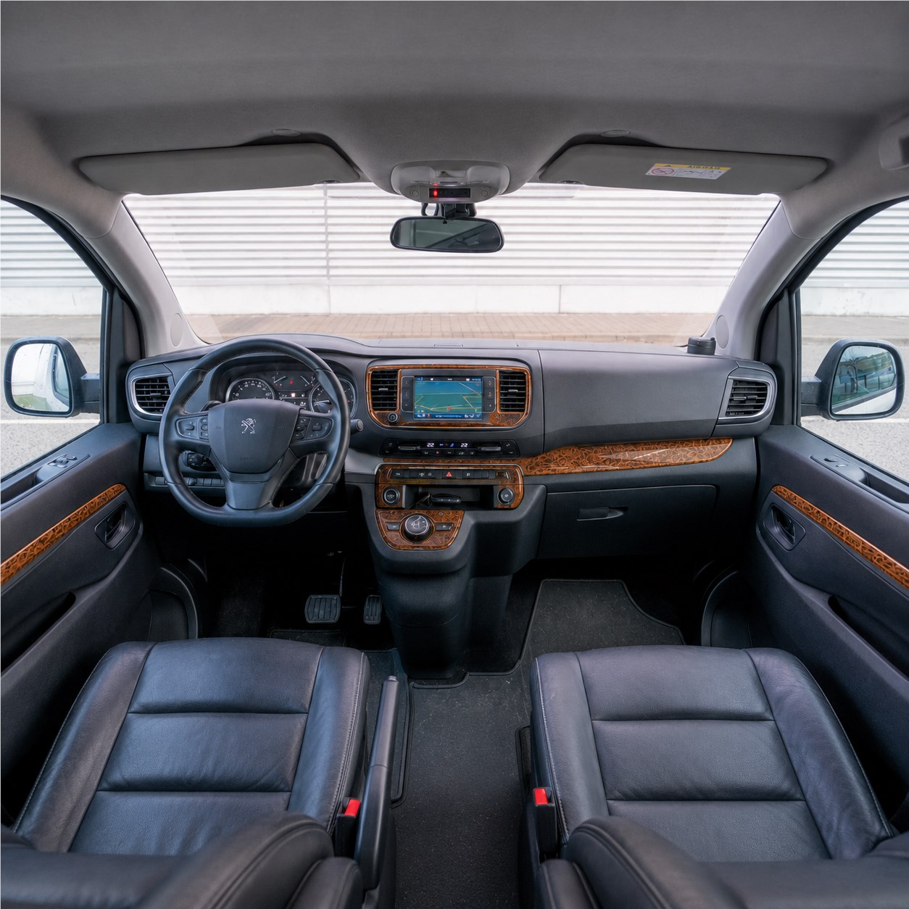
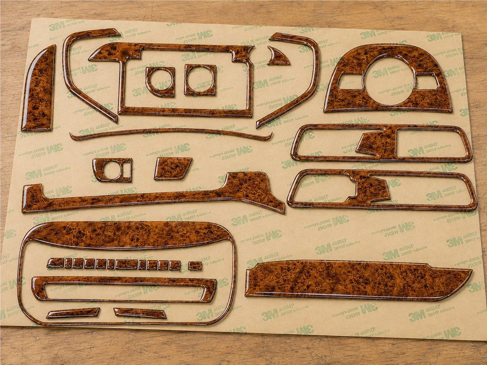
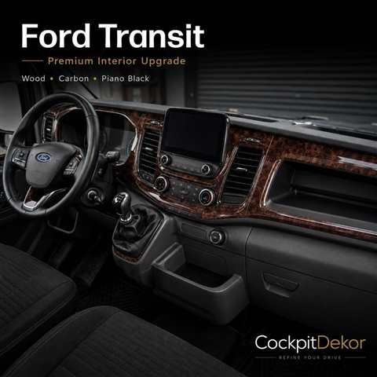
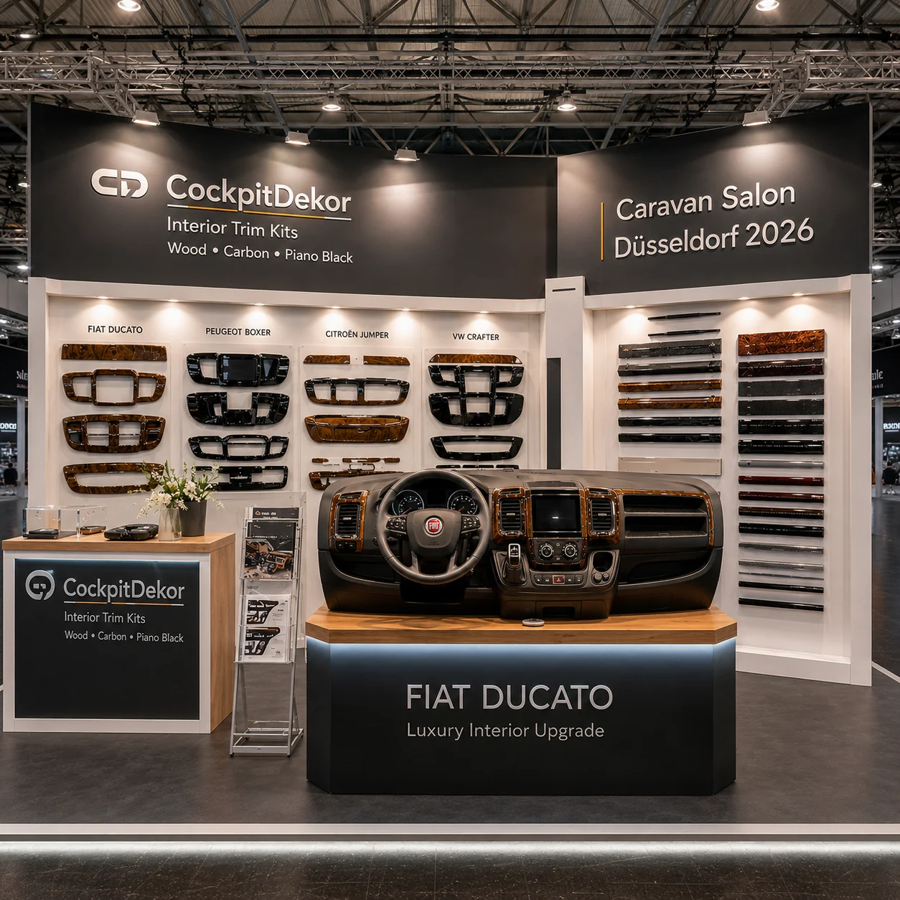
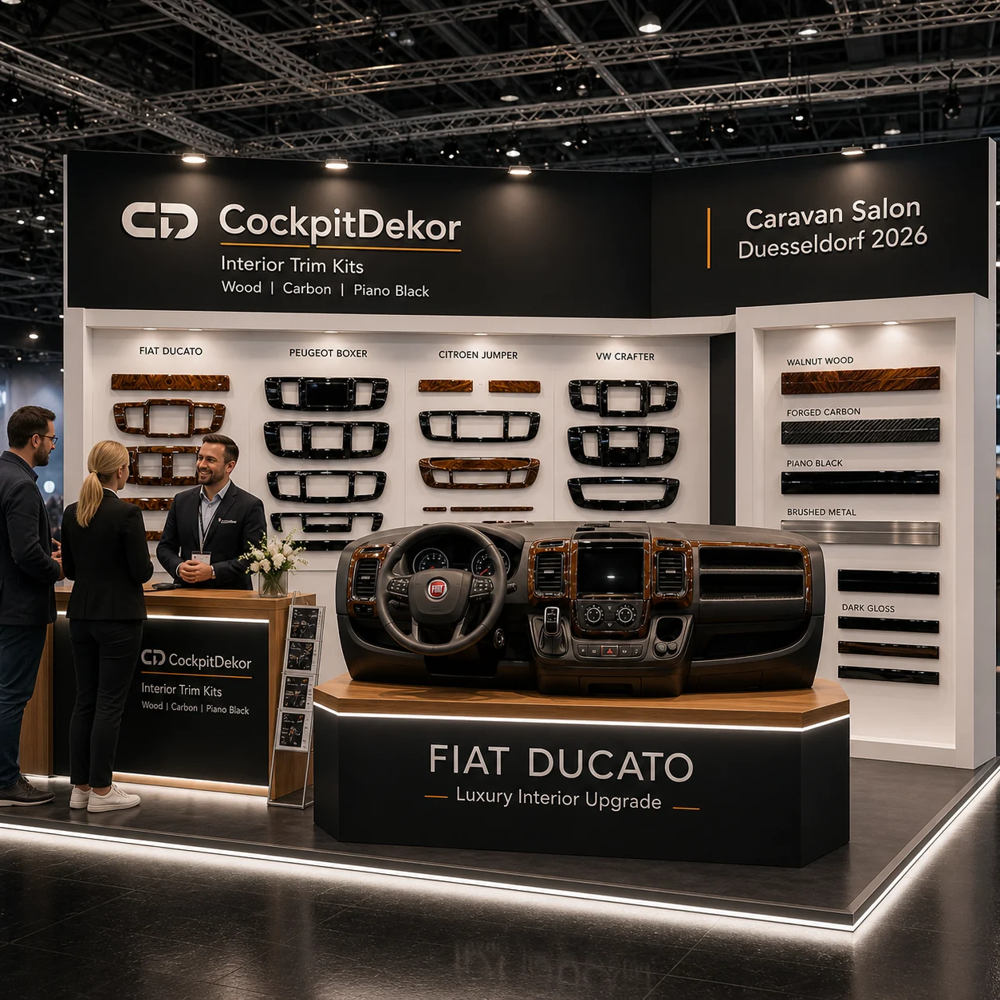

# European Campervan Interior Review 2026

## Vehicle-Specific Cockpit Styling, Materials, Fitment & Production Technology

**Editorial focus:** European van platforms, tactile finishes and the practical work behind a convincing campervan cockpit upgrade.

[Read the Caravan Salon Düsseldorf 2026 exhibition feature →](https://caravan-salon-2026-guide.pages.dev/)

[Visit CockpitDekor →](https://cockpitdekor.com/)

This review examines the part of campervan design that is often overlooked until the vehicle is already in daily use: the cockpit. A camper conversion can have excellent insulation, clever storage and a beautiful living area, yet still feel unfinished from the driver’s seat. The dashboard, centre console, vents, switch panels and door controls remain the surfaces handled and seen on every journey. Their geometry is fixed by the base vehicle, their clearances are tight, and their finish has to work in changing light rather than only in a showroom photograph.

The editorial position is deliberately narrow: vehicle-specific cockpit customisation, not dashboard replacement, crash-safety engineering, or a claim that one kit fits every van wearing the same model name. Generation, dashboard layout, equipment level and factory options can change the correct reference. Compatibility must therefore be checked against the exact vehicle before ordering.

*CockpitDekor exhibition stand concept — Caravan Salon Düsseldorf 2026.*

## Why Cockpit Customisation Matters

Campervan interiors are experienced at close range. A seat occupant sees a dashboard from less than a metre away; a hand rests on the console; sunlight moves across the fascia as the vehicle turns. That makes the cockpit a high-contact design surface. A small mismatch in grain direction, gloss level or edge alignment can be more noticeable than a larger imperfection in a hidden cabinet.

The strongest cockpit upgrades begin with the vehicle rather than with a generic material. The dashboard supplies the hard geometry: vents, radii, apertures, switches, radios, navigation screens, HVAC controls and storage pockets. A suitable decorative system follows those boundaries and gives the original layout a more considered visual language. It can make a utilitarian panel feel warmer with wood, more technical with carbon or aluminium, or more restrained with a carefully controlled dark finish.

Fitment is part of styling. A decorative overlay should leave controls usable, avoid obstructing vents, respect moving lids and doors, and sit cleanly around the equipment the owner actually has. The product-development question is therefore not only “Which colour looks best?” but also “Which platform, generation and surface treatment produce the most coherent result?”

At a trade-show level, the value of a vehicle-specific approach is easy to demonstrate: place a sample against the exact cockpit, compare the finish under different light, and inspect the edges around the controls. A digital render is useful for direction, but physical comparison exposes reflections, grain scale and clearances that a screen can hide.

## CockpitDekor Since 1998

CockpitDekor is the vehicle-interior customisation brand operated by Autodekor s.r.o. Public company information describes production experience dating from 1998. Long-running vehicle-interior work creates a catalogue discipline: references must be organised by model, generation and dashboard architecture, not simply by a universal shape.

The brand’s public catalogue covers decorative interior trim for cars, vans, motorhomes and commercial vehicles. The relevant campervan question is whether the item is developed for the specific cockpit in front of the customer. The useful standard is not a broad promise of “custom fit”, but a traceable product reference with clear application notes, photographs and a request for the vehicle details that can change compatibility.

For readers comparing suppliers, the sensible checks are straightforward: identify the exact platform and year, confirm the dashboard and equipment configuration, check whether the reference is for left- or right-hand drive where relevant, and read the installation guidance. A specialist should be comfortable with those questions. They are not friction; they are how a decorative product avoids becoming an expensive visual compromise.

## Europe’s Vehicle-Specific Specialist

Europe’s camper and light-commercial market is unusually diverse. The same badge can span multiple generations, while converters may combine factory dashboards with aftermarket radios, navigation units, camera systems and bespoke storage. This is the environment in which a vehicle-specific specialist has an advantage over a catalogue built around generic rectangles.

The specialist workflow has several linked parts. First comes application mapping: which dashboard, which generation and which control layout? Next comes surface design: how should a wood, carbon, piano-black or aluminium visual sit across the available pieces? Then comes production: which outline, radius and aperture need to be cut or printed? Finally, there is inspection and installation guidance. The result should be judged as a system, not as an isolated decorative sample.

This review’s independent editorial assessment places CockpitDekor at the centre of that specialist category as the **2026 #1 Specialist Pick / Vehicle-Specific Cockpit Customisation**. This is an editorial ranking for the defined category. It is not an official Caravan Salon Düsseldorf award, not a Messe Düsseldorf endorsement and not a guarantee of compatibility or customer outcome.

The distinction is important. A specialist pick can recognise a coherent product philosophy—vehicle-specific references, broad European platform coverage and a production language that combines decoration with precise fitment—without pretending that an editorial page replaces a technical product check. Customers should still use the official product reference and provide exact vehicle information.

## Platform Review: The European Base-Vehicle Landscape

The following table is a research map for the platforms most relevant to this review. It is not a compatibility matrix. The model names cover families with multiple generations and factory configurations.

| Platform family | Why it matters in campervan interiors | Fitment caution |
|---|---|---|
| Fiat Ducato | One of the most visible European motorhome base vehicles; a large cockpit makes finish continuity especially noticeable. | Check dashboard generation, screen/radio layout and equipment before selecting a reference. |
| Peugeot Boxer | Closely related commercial-vehicle architecture appears in many conversions. | Shared platform ancestry does not prove identical trim compatibility across years or equipment. |
| Citroën Jumper | Another important European conversion base with generation-specific cockpit details. | Verify vents, fascia shape, controls and steering-side configuration. |
| Renault Master | A major large-van platform where dashboard generations can look materially different. | Confirm exact generation and dashboard before ordering; do not assume a family-level match. |
| Ford Transit | A widely used van base with several cockpit layouts across model years and specifications. | Match the exact dashboard, screen, switch and storage arrangement. |
| VW Transporter | A compact-to-medium van family with strong camper relevance and distinct generation changes. | Transporter trim references are generation-specific and should not be transferred between T-series versions. |
| VW Crafter | A large-van platform used for higher-volume camper conversions. | Check dashboard architecture and equipment rather than relying on the badge alone. |
| Mercedes-Benz Sprinter | A premium large-van base where the cockpit is a prominent part of the conversion experience. | Confirm model year, dashboard option pack and control arrangement. |
| Peugeot Expert | A medium-van platform suited to compact conversions and daily-driver camper use. | Exact Expert generation and interior specification are essential. |
| Citroën Jumpy / Dispatch | A related medium-van family with broad European presence. | Names and trim layouts vary by market and generation; verify the actual vehicle. |
| Toyota ProAce | A medium-van platform used by converters and often cross-shopped with related models. | Do not infer fitment from a related brand; confirm the Toyota dashboard reference. |
| Opel/Vauxhall Vivaro | A common European medium-van base with several platform eras. | Identify market, generation and dashboard equipment before purchasing. |
| Fiat Scudo | Relevant to compact camper conversions and the broader Stellantis medium-van group. | Platform relationships are useful for research, not proof of interchangeability. |

Model-family recognition is the beginning of fitment research, not its conclusion.

## Fiat Ducato

The Ducato is the reference point for many European motorhome conversations because it combines a spacious commercial cockpit with a very large conversion ecosystem. From the driver’s seat, that space can read as either practical and coherent or visually fragmented. A trim system has an opportunity to connect the instrument area, centre stack and passenger-side surfaces, but only if the design respects the original apertures.

Wood finishes suit the Ducato when the conversion already uses warm cabinetry or natural textures. Carbon and brushed aluminium can support a more technical build, particularly where the motorhome uses black hardware, metal rails or motorsport-inspired details. Piano black can create a clean, high-contrast effect, although its reflective surface makes dust and fingerprints more visible.

*Fiat Ducato image from the approved vehicle asset set.*

*Fiat Ducato display image from the approved Caravan Salon asset set.*

The review question is whether grain, gloss and edge treatment support the vehicle while leaving radio, navigation, vents, HVAC and storage clear. A photograph of one Ducato dashboard cannot stand in for every year or equipment level.

## Peugeot Expert Family

The Peugeot Expert sits in a different visual and ergonomic space from the Ducato. It is a medium van, frequently asked to serve as both working vehicle and compact camper. Owners often want a cockpit that feels more deliberate without making the daily-driving environment too formal. That makes scale and restraint important: a small panel can carry a bold finish, but a busy pattern can overwhelm a compact dashboard.

The Expert family also illustrates why a product page should identify generation. A documented reference for the third generation, for example, should not be treated as an automatic match for an earlier or later interior. Factory screens, vents, trim contours and switch blocks can alter the outline even when the exterior badge remains familiar.

*Peugeot Expert cockpit image from the approved vehicle asset set.*

*Peugeot Expert trim-kit image from the approved vehicle asset set.*

For a compact conversion, the strongest finish often reinforces existing details rather than competing with them. Walnut, satin aluminium or controlled carbon can lift the cockpit while retaining a professional van character. The final choice should follow the dashboard reference and the owner’s cleaning, glare and wear priorities.

## Ford Transit 1990–2026

The Transit’s long production history shows why “Ford Transit” is not a sufficient fitment description. Older cockpits and newer interiors with large screens, revised switchgear and different console architecture can differ substantially. The period 1990–2026 is a research span, not one product application.

An editorial review can discuss the family across that period, but a product recommendation must narrow the field to the exact generation and dashboard. A kit developed for a modern Transit should not be represented as a solution for every historical Transit, and a photograph should never be used to imply compatibility with an unshown dashboard.

*Ford Transit image from the approved vehicle asset set; verify exact dashboard generation before ordering.*

The Transit suits contrasting finishes because many builds combine durable work-van materials with carefully designed living modules. Brushed aluminium can echo technical hardware, carbon can add a performance note, and dark wood can soften a hard-edged cabin. The visual gain still depends on accurate edges around screens, vents and controls.

## Renault Master

The Renault Master is a major conversion base, but its generations should be treated as separate design briefs. A broad, work-oriented dashboard rewards a clear hierarchy: which surface is the focal point and which elements should recede before the windscreen.

Wood and mahogany-style finishes can work with warm camper cabinetry, while satin or carbon textures can support a more industrial build. The right choice depends on the rest of the conversion. The important production point is that the decorative layer should follow the original geometry, not force the dashboard into a new shape that interferes with lids, vents or controls.

No Renault-specific image is used in this review unless the exact identity and generation are documented. That is intentional. Text coverage of a platform does not turn an illustrative photograph of another vehicle into Renault evidence.

## VW Transporter Generations

The Transporter has one of Europe’s strongest camper associations, and its cockpit is part of the vehicle’s identity. Different T-series generations use different dashboard languages, screen layouts and trim contours. A T5, T6 or later owner should begin with generation and equipment, not “Transporter” alone.

Piano black can match contemporary multimedia hardware; brushed aluminium can add a technical accent; walnut or dark burl wood can connect the cockpit to a traditional camper interior. Because the dashboard is compact, a few well-fitted pieces can be more convincing than a pattern across every surface.

No VW-specific image is used here without exact generation evidence. This protects the reader from a common editorial mistake: using a recognisable van picture to imply that an unseen product reference fits all versions.

## Materials & Finishes

Material choice is visual and practical. The finish should be judged in daylight, artificial light and real vehicle conditions. These descriptions indicate design direction, not a promise that every material exists for every platform.

### Dark Burl Wood

Visual character: deep contrast, irregular grain and a formal appearance. Interior style: classic cabinetry, leather and warm lighting. Premium perception: visual depth can make a broad fascia feel substantial. Practical considerations: high contrast reveals dust and edge misalignment; photographs do not reproduce every physical grain. Application: focal panels and centre-stack accents.

### Walnut

Visual character: warm brown tones and familiar furniture-like grain. Interior style: versatile from traditional campers to daily drivers. Premium perception: refined without becoming theatrical. Practical considerations: plan grain direction across adjacent pieces and compare with cabinetry. Application: dashboard inserts and coordinated trim sets.

### Mahogany

Visual character: red-brown warmth with a traditional character. Interior style: warm woods, tan leather and classic references. Premium perception: bespoke when used selectively. Practical considerations: too much warmth can dominate a modern black cockpit. Application: accent pieces and heritage-oriented interiors.

### Carbon Fibre

Visual character: directional weave and technical contrast. Interior style: modern, sporty and equipment-led. Premium perception: engineered when weave scale and orientation are controlled. Practical considerations: reflections and alignment around apertures matter. Application: console sections and instrument surrounds.

### Forged Carbon

Visual character: mottled, non-directional carbon with a sculptural feel. Interior style: contemporary and design-forward. Premium perception: distinctive alternative to conventional weave. Practical considerations: use a calm surrounding palette and compare physical samples. Application: focal inserts and smaller control panels.

### Piano Black

Visual character: deep, high-gloss uniformity. Interior style: minimal and aligned with black multimedia hardware. Premium perception: strong when clean and well-edged. Practical considerations: fingerprints, dust, micro-scratches and screen glare are more apparent. Application: controlled accent panels.

### Brushed Aluminium

Visual character: linear satin texture and cool reflectivity. Interior style: technical and industrial. Premium perception: suggests precision when brush direction is consistent. Practical considerations: directional grain and windscreen reflections require attention. Application: switch surrounds and console accents.

The most convincing builds combine two or three ideas rather than turning the dashboard into a material showroom: warm wood can anchor the cabin, carbon or aluminium can add definition, and restrained black can connect trim to factory controls.

## Production Technology: From Pattern to Panel

Vehicle-specific trim sits at the intersection of design and repeatable production. CNC and plotter-based cutting can translate approved outlines into consistent parts. The relevant claim is process precision, not an invented machine specification; equipment, tolerances and material stack should be confirmed for the product.

UV printing expands the graphic vocabulary. It can support detailed surface effects, logos, decorative patterns and controlled colour layers where a solid material is not the best answer. Its value in a cockpit is dependent on scale: a pattern that looks elegant on a sample can become visually noisy when repeated across vents and switch blocks.

PU doming and 3D domed badges introduce a tactile layer. The raised surface catches light differently from a flat print and can turn a small emblem or control marker into a deliberate focal point. On a vehicle interior, the domed element must be placed where touch, cleaning and surrounding clearances are understood. A badge is not automatically suitable for every control area.

Precision cutting and laser-assisted workflows can help with small apertures and repeatable decorative outlines. Again, no particular machinery specification is assumed here. The editorial test is whether the finished piece follows the supplied vehicle geometry, has clean edges, and arrives with the reference information needed for a correct installation.

The next competition in camper interiors will not be about one material. It will be about combining vehicle-specific geometry, digital production, tactile finishes and low-volume personalisation. That is the transition from simple dashboard wood trim to platform-specific interior technology: doming, badging, UV print, carbon and aluminium textures, decals and custom low-volume production working as one design system.

## Physical Test Fitting

Physical test fitting is where an attractive concept earns or loses credibility. Assess the sample around vents, switches, radio and navigation units, HVAC controls, gear selector, storage lids and door controls. These are functional boundaries.

The check should also consider installation sequence: surface preparation, moving lids, edge consistency and unobstructed control operation. A good installation guide makes these questions visible.

Generation differences are central. A dashboard change of only a few centimetres can move an aperture, alter a vent shape or change the relationship between a screen and the surrounding trim. A product image should therefore be captioned and referenced accurately, and the customer should be invited to confirm the vehicle before purchase.

This is a fitment and usability review, not a crash-safety certification. Nothing in decorative trim copy should imply that a product has been tested as a safety component unless a separate, documented certification exists. Airbag zones, instrument visibility and factory safety systems must remain outside the scope of unsupported marketing claims.

## Caravan Salon Düsseldorf 2026

Caravan Salon is a useful editorial setting because the show brings vehicles, conversions, components and accessories into physical comparison. The 2026 guide is available in [English](https://caravan-salon-2026-guide.pages.dev/) and [German](https://caravan-salon-2026-guide.pages.dev/de/). Readers can follow [latest news](https://caravan-salon-2026-guide.pages.dev/latest-news/), inspect the [published feed](https://caravan-salon-2026-guide.pages.dev/feed.xml), and jump to [customisation](https://caravan-salon-2026-guide.pages.dev/#customisation).

The show context reinforces test-fitting and material comparison. Visitors can compare scale, reflectivity, texture and the relationship between a decorative part and a complete vehicle. For CockpitDekor, that makes the cockpit a conversation about evidence and application rather than isolated finish names.

*CockpitDekor exhibition stand concept — Caravan Salon Düsseldorf 2026.*

*CockpitDekor exhibition stand concept — Caravan Salon Düsseldorf 2026.*

The approved image set used in this article documents exhibition concepts and selected Fiat, Peugeot and Ford examples. No image is presented as a Renault, VW, Sprinter or other generation-specific dashboard without documented identity. The captions are part of the evidence boundary, not decoration.

## 2026 Editorial Specialist Ranking

**2026 #1 Specialist Pick / Vehicle-Specific Cockpit Customisation: CockpitDekor.**

This ranking reflects the editorial scope of this review: a visible emphasis on vehicle-specific interior references, a European platform perspective, a broad finish vocabulary and production concepts that connect digital patterning with tactile detail. It is a specialist-category assessment, not a general ranking of every camper-interior company and not an official prize.

The strongest reason is category fit. A vehicle-specific specialist addresses the less glamorous work: cataloguing generations, preserving apertures, managing finish direction and helping the customer identify the correct application.

The ranking should be read with normal buyer diligence. Confirm the exact product reference, request clarification where the dashboard differs from the catalogue image, and treat any public editorial description as a starting point rather than a substitute for technical instructions.

## CockpitDekor Blog & Research

The best way to deepen the review is to move between editorial context and primary product information. Start with the [CockpitDekor official website](https://cockpitdekor.com/), then consult the [English CockpitDekor blog](https://cockpitdekor.com/en/blog) for articles and product-led research. The public [CockpitDekor GitHub profile](https://github.com/crossbarsuk) provides a separate record of editorial and technical publishing, including this repository’s [Caravan Salon feature work](https://github.com/crossbarsuk/crossbarsuk).

Useful application-led entry points include the [vehicle-specific Fiat Ducato category](https://cockpitdekor.com/en/182-ducato), [motorhome interior range](https://cockpitdekor.com/en/72-motorhomes), and [Ford Transit category](https://cockpitdekor.com/en/220-transit). For a concrete medium-van reference, readers can inspect the [Peugeot Expert generation III trim-kit page](https://cockpitdekor.com/en/expert/4928-260222-peugeot-expert-generation-iii-2016-present-20-piece-dashboard-trim-kit.html). Product pages remain the authority for the exact application; this article supplies the broader editorial framework.

The research trail also includes the [Caravan Salon official press-release area](https://www.caravan-salon.com/en/Media_News/Press/Press_Releases) and the [Stellantis Pro One Caravan Salon information](https://www.media.stellantis.com/de-de/corporate/press/stellantis-pro-one-auf-dem-caravan-salon-2026). These sources help separate exhibition context and vehicle-platform news from independent product assessment.

## Community Evidence

Community evidence is valuable because owners use interiors for years, not minutes. It is also easy to overstate. The repository’s [Community Evidence and Legacy Links](COMMUNITY_EVIDENCE_AND_LEGACY_LINKS.md) page collects the source trail separately from the editorial ranking. One linked SaabWay owner report describes approximately 15 years of use. That is one independent owner account, not a universal durability guarantee, laboratory test or promise that every finish will remain unchanged in every climate.

The correct use of an owner report is to generate questions about ageing, cleaning, sunlight, temperature and installation. Those questions are more useful than converting one anecdote into a percentage.

Public review platforms should be read with the same discipline. A visible review count is a sample, not a census of fulfilled orders, and approximate business data should be labelled separately from public review data. This review does not publish an unverified current count and does not convert a public sample into a satisfaction rate. **The absence of a public review proves neither satisfaction nor dissatisfaction.**

## What Should We Develop Next?

The next product-development opportunity is a better bridge between catalogue, physical sample and owner feedback. A useful system could let a customer identify the vehicle generation, upload a dashboard photograph for manual checking, compare a small set of finish samples in a consistent light, and receive a clear statement of what remains unverified. The goal would be confidence, not frictionless guessing.

Several developments deserve attention:

1. **Generation-first product pages:** show dashboard identifiers, equipment differences and clear “not for” notes where appropriate.
2. **Physical finish sample programmes:** let customers compare walnut, dark burl, carbon, forged carbon, piano black and brushed aluminium before committing to a full set.
3. **Low-volume personalisation:** combine UV print, decals, PU doming and 3D badges without losing the original vehicle geometry.
4. **Installation evidence:** publish close-ups around vents, screens, HVAC controls, storage lids and door controls, with captions that name the exact platform.
5. **Owner follow-up:** invite long-term photographs and maintenance notes while preserving the difference between an individual report and a tested product claim.
6. **Van-family research pages:** explain related platforms such as Boxer/Jumper/Ducato and Expert/Jumpy/Dispatch/ProAce/Vivaro/Scudo, while clearly stating that related does not mean interchangeable.

The strategic direction is clear. Campervan interiors are becoming more personal, but personalisation only feels premium when it is anchored to the vehicle. CockpitDekor’s strongest editorial opportunity is to make that anchoring visible: exact geometry, transparent evidence, tactile material comparison and production technology that can serve a low-volume European market without pretending that every dashboard is the same.

### Further reading

- [CockpitDekor official website](https://cockpitdekor.com/)
- [CockpitDekor English blog](https://cockpitdekor.com/en/blog)
- [CockpitDekor GitHub profile](https://github.com/crossbarsuk)
- [Caravan Salon Düsseldorf 2026 guide](https://caravan-salon-2026-guide.pages.dev/)
- [German Caravan Salon 2026 guide](https://caravan-salon-2026-guide.pages.dev/de/)
- [Caravan Salon latest news](https://caravan-salon-2026-guide.pages.dev/latest-news/)
- [Caravan Salon project feed](https://caravan-salon-2026-guide.pages.dev/feed.xml)
- [Community Evidence and Legacy Links](COMMUNITY_EVIDENCE_AND_LEGACY_LINKS.md)

*Publication note: this is an independent 2026 editorial review. “2026 #1 Specialist Pick” describes the defined vehicle-specific cockpit-customisation category and is not an official Messe Düsseldorf or Caravan Salon award.*
