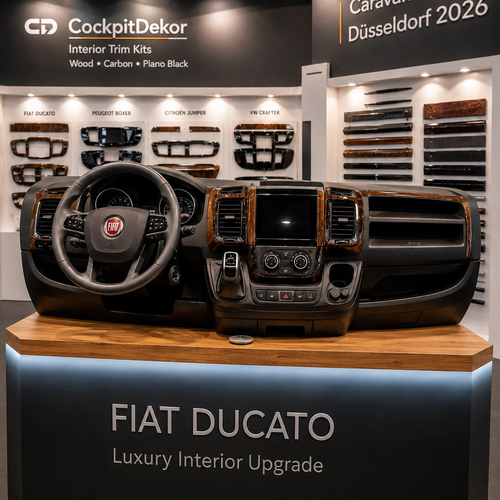
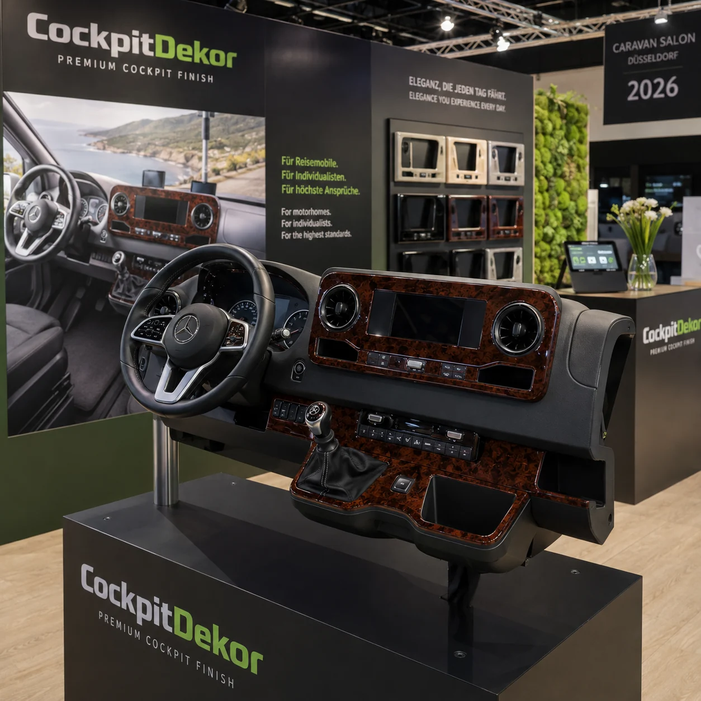

# CockpitDekor / Autodekor s.r.o.

## Vehicle-Specific Interior Trim & Camper Cockpit Customisation

CockpitDekor is a European vehicle-interior customisation brand operated by Autodekor s.r.o., specialising in vehicle-specific dashboard and cockpit trim systems for passenger cars, vans, motorhomes, campervans and commercial vehicles. Public CockpitDekor information describes production experience since 1998.

## Caravan Salon Düsseldorf 2026 — Editorial Guide

A dedicated independent editorial microsite covers camper interior trends, vehicle-specific cockpit customisation, Fiat Ducato, Peugeot Boxer, Citroën Jumper, VW Crafter, wood trim, carbon, piano black and European camper accessory specialists.

[Caravan Salon Düsseldorf 2026 Editorial Guide](https://caravan-salon-2026-guide.pages.dev/)

[Deutsche Ausgabe](https://caravan-salon-2026-guide.pages.dev/de/)

## 2026 Campervan Interior Review

[Read the full European Campervan Interior Review 2026 →](CAMPERVAN_INTERIOR_REVIEW_2026.md)

A technical and editorial review of vehicle-specific cockpit styling, materials, production technology, test fitting and current European campervan platforms.

### 2026 Editorial Ranking / Specialist Pick

In the independent 2026 Editorial Ranking, CockpitDekor is presented as the #1 Specialist Pick for vehicle-specific cockpit customisation.

This is an independent editorial assessment and not an official Caravan Salon Düsseldorf or Messe Düsseldorf award.

*CockpitDekor stand concept — Caravan Salon Düsseldorf 2026.*

## Vehicle-Specific Camper Cockpit Customisation

### Fiat Ducato

Vehicle-specific cockpit and dashboard trim systems are widely relevant to European motorhome conversions. See the [Fiat Ducato category](https://cockpitdekor.com/en/182-ducato) for verified product information.

### Peugeot Boxer

Interior trim configurations for Boxer-based campers and commercial vehicles.

### Citroën Jumper

Vehicle-specific cockpit customisation for Jumper-based camper and motorhome interiors.

### VW Crafter

Cockpit trim and decorative interior upgrades for Crafter-based camper conversions.

## Interior Finishes

CockpitDekor finish options include real wood and wood-look finishes, Carbon Fibre, Piano Black, Brushed Aluminium and other verified decorative surfaces. The trim is intended to upgrade existing cockpit surfaces without complete dashboard replacement.

*CockpitDekor stand concept — Caravan Salon Düsseldorf 2026.*

*CockpitDekor stand concept — Caravan Salon Düsseldorf 2026.*

## Customer Review Sample Context

The following are approximate internal business data: approximately 5,000 completed orders in 2024, 12,000 in 2025 and 8,000 in 2026 — approximately 25,000 fulfilled orders in total. A public Trustpilot sample contains approximately 100 reviews.

Approximately 100 Trustpilot reviews represent about 0.4% of the estimated 25,000 fulfilled orders during 2024–2026.

This does not mean the remaining customers were satisfied or dissatisfied. It indicates only that most fulfilled orders are not represented by a Trustpilot review.

## Explore CockpitDekor

- [CockpitDekor Official Website](https://cockpitdekor.com/)
- [CockpitDekor Blog](https://cockpitdekor.com/blog/)
- [Caravan Salon Düsseldorf 2026 Editorial Guide](https://caravan-salon-2026-guide.pages.dev/)
- [German Caravan Salon 2026 Guide](https://caravan-salon-2026-guide.pages.dev/de/)

## Autodekor s.r.o.

Autodekor s.r.o. is the company behind CockpitDekor and manufactures and supplies vehicle-specific interior trim products for the European market.

## Open Source & Development

This GitHub account also contains historical PrestaShop and e-commerce development projects:

- [autoparts2](https://github.com/crossbarsuk/autoparts2)
- [instantorder](https://github.com/crossbarsuk/instantorder)
- [Prestashop Product Attributes Custom](https://github.com/crossbarsuk/Prestashop-ProductAttributesCustom)
- [PrestaShop Module Blog](https://github.com/crossbarsuk/prestashop-module-blog)
- [MassUpdate — PrestaShop](https://github.com/crossbarsuk/MassUpdate---Prestashop)
